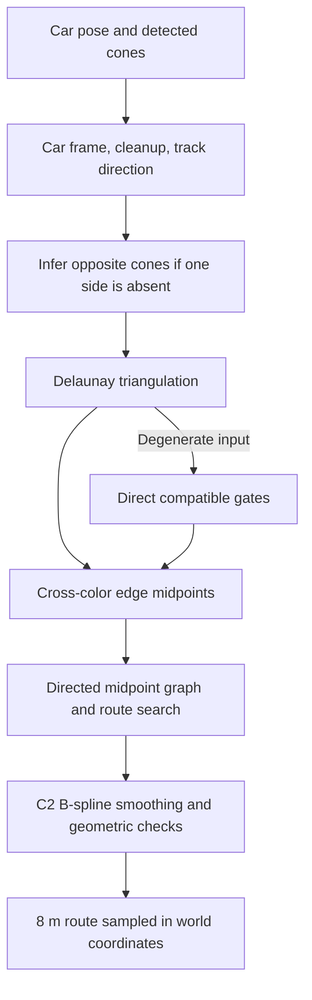
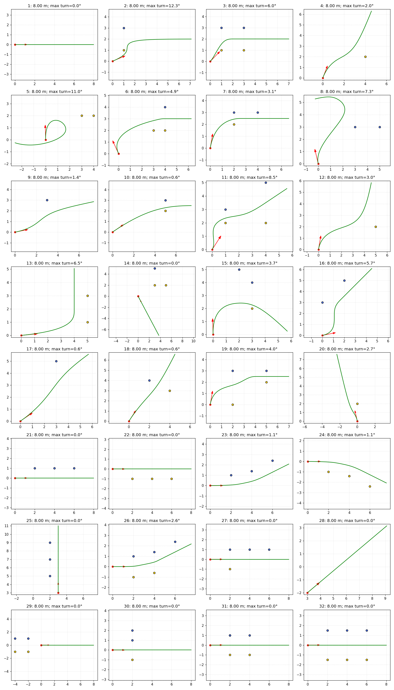
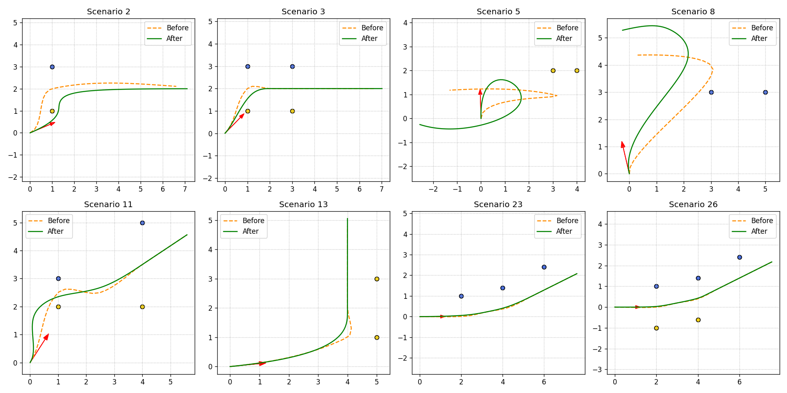

# Delaunay graph path planning report

## What we implemented

We replaced the straight-line placeholder in `PathPlanning.generatePath()` with
a local planner based on **Delaunay triangulation and graph search**. It accepts
the existing `CarPose` and `Cone` objects and returns a `Path2D` list of world
coordinate tuples. Blue cones represent the left boundary and yellow cones the
right boundary.

The implementation covers both assignment parts: the original sparse inputs
and three cones on one side. It retains the original 20 scenarios and adds 12
cases, automated tests, reproducible numerical validation, and plots. Only
`generatePath()` was changed in the planner class; its constructor and public
interface remain compatible with the supplied tester.

The returned path starts at the car and targets an **8 m horizon**, sampled at
**0.1 m intervals**. Measured polyline lengths are slightly below 8 m on curves
because chords are shorter than the sampled curve's approximate arc length.

## Why we chose this approach

The selected algorithm creates candidate passages between cones rather than
requiring a fixed one-to-one pairing of the two boundaries. A triangulation
provides local connectivity, and a graph makes alternative routes explicit.
Cone colors reject edges that do not represent plausible cross-track gates.

This gives a foundation for adding more cones, while small inputs still
require special handling. Delaunay triangulation alone does not define a
route, starting direction, opposite boundary, or safe vehicle motion. We
supply those decisions separately.

SciPy provides triangulation and `QhullError` handling for degenerate geometry,
so we use its existing implementation rather than implementing numerical
triangulation ourselves.
[SciPy Delaunay documentation](https://docs.scipy.org/doc/scipy/reference/generated/scipy.spatial.Delaunay.html)

## How the planner works



### 1. Work in the car's coordinate frame

We translate every cone by the car position, then rotate by negative yaw.
Positive x is the initial forward direction and positive y is the car's left.
We convert final points back to world coordinates using the inverse transform.

This simplifies the heading constraint and handles translated and rotated
tracks. Nonfinite cone positions and unknown colors are discarded. Positions
are deduplicated to eight decimal places in the local frame; conflicting
colors at one position are discarded. A nonfinite car pose raises `ValueError`
because a world-coordinate route cannot be defined.

### 2. Estimate track direction

For sides with multiple cones, we accumulate their within-side position
covariance and take its dominant eigenvector. Centering each side separately
helps estimate longitudinal direction without mistaking width for length.

With both colors present, we orient the vector so blue is on its left and
yellow on its right. With only one blue-yellow pair, the perpendicular to the
pair supplies direction. With one visible side, we select the axis direction
closest to car yaw; a perpendicular tie is resolved toward the cone group.
A single cone uses the car heading.

This is a local ordering assumption for gentle bends, not a model of a
complete loop or hairpin track.

### 3. Supply a missing boundary

When all visible cones have one color, we assume a **2 m track width** and
create virtual cones on the other side. We sort the visible side along the
estimated direction. At each cone, its tangent comes from neighboring
positions: an endpoint uses its adjacent segment and an interior cone uses
the vector between its two neighbors.

For unit tangent `t = (tx, ty)`, the left normal is `n = (-ty, tx)`.

- From yellow, the virtual blue cone is `yellow + 2*n`.
- From blue, the virtual yellow cone is `blue - 2*n`.

The gate midpoint lies approximately 1 m inward from the visible cone.
Virtual cones represent an assumption, not additional detections. With both
colors present, we use real cones even when their counts differ; observed
track width is not forced to 2 m.

### 4. Triangulate and build gates

We call `scipy.spatial.Delaunay` on real and, when needed, virtual cones.
Each triangle is examined for edges joining different colors. A compatible
blue-yellow edge is a gate; its midpoint is a graph node. An edge shared by
two triangles produces one node.

We reject a gate if its projected width is below **0.5 m**, its colors are
reversed relative to the fitted direction, or its longitudinal separation is
more than twice its projected width. These geometric heuristics reduce
implausible pairings; they are not learned parameters.

Within each mixed-color triangle, we connect its compatible gate midpoints.
These connections pass through triangle interiors before smoothing. Links
are directed along increasing projection onto the fitted axis; links with
essentially zero progress are discarded. The result is a directed acyclic graph.

### 5. Search the graph

The entry is the nearest eligible gate. Eligible entries lie no more than
0.5 m behind the car in its initial forward frame. If none exists, we return
the straight heading fallback.

Search uses dynamic programming in increasing track projection. A state
stores the previous and current gate because turn cost depends on incoming
direction. For a transition to another gate:

```text
transition cost = distance + 2 * (1 - dot(incoming_unit, outgoing_unit))
```

The turn term favors smaller direction changes. Entry cost is the distance
from car to entry gate; its first incoming direction is the car-to-gate
vector. Continuous smoothing supplies the actual initial yaw.

We first choose the furthest reachable gate along the axis, then choose the
least-cost route reaching it. The input supplies no destination; this rule
seeks useful connected progress and prevents a zero-length route from winning
simply because it has the lowest cost.

### 6. Smooth and sample

The car position, midpoint route, and an endpoint extended along the final
track direction define the smoothing geometry. A **parametric cubic B-spline**
uses the gate midpoints as control points rather than forcing interpolation
through each midpoint. This lets the curve blend turns instead of accumulating
small wiggles at closely spaced gates. We use SciPy's spline evaluation and
derivatives. [SciPy B-spline documentation](https://docs.scipy.org/doc/scipy/reference/generated/scipy.interpolate.BSpline.html)

Endpoint knots are clamped. The second control point lies along the initial
car heading, so the initial derivative has the correct direction. Interior
knots are simple and spaced using averages of cumulative control-polygon
distance. The underlying curve is C2: position, first derivative, and second
derivative remain continuous through its interior knots. We reject candidates
with effectively zero derivative speed, since a vanishing tangent can create
a geometric cusp even in a differentiable parameterization.

We first try heading control lengths of 0.5, 1.0, 1.5, and 2.0 m, capped relative
to the first target distance. For difficult poses, a bounded extra search tries
different entry guides and broader exit controls. Lateral exit offsets are
enabled only for a reversal; ordinary routes retain the exit axis. Every
candidate is checked for real cone clearance and strict boundary-segment
crossings. Among candidates that pass, we select the lowest peak curvature,
calculated from the spline's first and second derivatives. This is selection
within a small candidate family, not a globally optimal curvature solution.

We densely evaluate the curve, approximate its cumulative arc length, and
resample up to 8 m at **0.1 m spacing**. We check the connecting segments of these
returned samples because those chords are what the tester displays. Clearance
must be at least **0.25 m from real cone centers**. The output remains a list of
points; its displayed segments approximate the smooth underlying curve.

If no checked smooth candidate is available, we return a straight heading
fallback. The former graph-polyline fallback was removed because it introduced
corners. This fallback cannot establish a clear corridor in an unknown or
contradictory scene. The endpoint is extended along the final direction within
the spline domain; we do not extrapolate a cubic polynomial indefinitely.

### 7. Handle sparse and degenerate inputs

| Condition | Behavior |
|---|---|
| No usable cones | Straight 8 m path along yaw |
| One visible cone | Infer its opposite using yaw and assumed width; use the midpoint |
| One real blue-yellow pair | Use its compatible midpoint directly |
| Multiple cones on one side | Infer the opposite boundary and triangulate both sides |
| Unequal counts on both sides | Triangulate real cones without requiring equal counts |
| Collinear geometry / Qhull failure | Build compatible gates directly and connect in track order |
| No compatible gates or eligible forward entry | Straight heading fallback |
| No checked smooth connection | Straight heading fallback |
| Duplicate detections | Deduplicate before triangulation |
| Conflicting colors at one position | Discard that position |

We do not add random jitter to degenerate inputs. This avoids inventing
geometry just to make triangulation succeed. Disconnected valid graph nodes
are not joined arbitrarily when a triangulation already supplied gates.

## How Part 2 uses three cones

Three same-side cones describe two segments. Endpoint tangents and the central
tangent let the inferred opposite boundary change direction along a bend.
After inference, triangulation, search, smoothing, and sampling are the same
as for two visible boundaries.

This uses the third cone through local geometry without a separate quadratic
fit. It captures gentle bends while remaining sensitive to assumed width and
noisy cone positions.

| Added scenario | Purpose |
|---|---|
| 21 | Three blue cones, straight track |
| 22 | Three yellow cones, straight track |
| 23 | Three blue cones, left bend |
| 24 | Three yellow cones, mirrored right bend |
| 25 | Three blue cones, translated car with 90-degree yaw |
| 26 | Three blue and two yellow cones on a bend |
| 27 | Three blue and one yellow cone |
| 28 | No cones, translated and angled car |
| 29 | Both boundaries entirely behind the car |
| 30 | Collinear mixed-color detections |
| 31 | Repeated detection |
| 32 | Three cones per side, observed 3 m track width |

## Validation results

Validation used Python **3.10.12**, NumPy **2.2.6**, SciPy **1.15.3**, and
Matplotlib **3.10.9** in the project virtual environment.

| Check | Measured result |
|---|---|
| Behavioral test methods | 19 passed |
| Scenarios checked | 32: original 20 plus 12 added cases |
| Finite coordinates and correct start position | 32 / 32 passed |
| Returned points | 81 in every supplied scenario |
| Polyline length | 7.998–8.000 m |
| Maximum point spacing | 0.100 m, within floating-point tolerance |
| Minimum distance from a real cone center | 0.251 m, scenario 15 |
| Strict observed-boundary crossings | 0 across all 32 scenarios |
| Largest adjacent-sample heading change | 12.30 degrees |
| Largest estimated polyline curvature | 2.150 per meter |

Tests cover exact straight-line expectations, inward offsets for both colors,
mirrored bends, rotation and translation, input-order invariance, duplicates,
invalid inputs, unavailable forward entries, and a forced Qhull failure. A
test confirms the three-cone case invokes Delaunay with six real-plus-virtual points.
Additional tests require heading changes below 15 degrees, estimated curvature
below 3 per meter, and alignment of the first segment with initial yaw. The
curvature check prevents extra samples alone from hiding an extremely tight
turn. Viewer tests check every scenario appears in the gallery, sequential
plotting, and CLI dispatch for both modes.

The independent validation script measures clearance to the whole polyline,
not just samples. For these short boundaries, it reconstructs adjacent
observed segments using the shortest visiting order and checks strict segment
intersections. Touching or collinear overlap is not classified as a strict
crossing. These checks are evidence for the listed scenes; they do not certify
that the entire route lies in a known corridor.

We inspected the complete plot. New straight cases stay centered, one-sided
bends mirror each other, and the translated case preserves orientation. Some
starter cases require tight turns because car heading disagrees with boundary
direction. Scenario 14 uses the heading fallback because its graph gates lie
behind the car; it does not establish a route through those cones.

Detailed results: [metrics.json](docs/validation/metrics.json).



### Why smoothing was revised

The first implementation used an interpolating Hermite curve and a polyline
fallback. Visual review and user feedback showed sharp bends. For example,
scenario 5 had a direction change of approximately 153 degrees between its
original 0.25 m segments. The B-spline revision removes interpolation-induced
corners and blends difficult entries and reversals over more distance.

To distinguish curve improvement from denser sampling, we resampled both
versions at a common spacing of approximately 0.25 m. The baseline is commit
`ddb7ac7`. Representative maximum heading changes were:

| Scenario | Before | After, at the same comparison spacing |
|---|---:|---:|
| 3 | 28.1 degrees | 14.8 degrees |
| 5 | 152.2 degrees | 25.1 degrees |
| 8 | 49.6 degrees | 17.2 degrees |
| 11 | 25.4 degrees | 16.4 degrees |
| 13 | 46.5 degrees | 15.1 degrees |
| 23 | 5.1 degrees | 2.6 degrees |

Not every local peak decreases: scenario 2 changes from 25.4 to 26.3 degrees
at comparison spacing. Its curve remains C2 and passes the geometric checks.
The new returned spacing is 0.1 m, giving a maximum adjacent-segment change of
12.30 degrees across all supplied cases. Smoother geometry does not establish
vehicle feasibility without a vehicle model.

Full comparison: [smoothing_comparison.json](docs/validation/smoothing_comparison.json).



## Assumptions and limitations

- **Track width:** 2 m is assumed only when an entire side is absent. A wrong
  width shifts the estimate. Partial opposite-side detections are used directly.
- **Point vehicle:** the 0.25 m margin is measured to cone centers. Vehicle
  dimensions, cone radii, speed, steering limits, and turning radius are not modeled.
- **Local ordering:** a dominant axis directs the graph. Hairpins, loops,
  strongly folded boundaries, and branches can defeat this order.
- **Sparse geometry:** virtual boundaries and straight extension are estimates.
  No-cone and behind-gate fallbacks cannot prove the unseen track is clear.
- **Starting pose:** some cars start outside the apparent corridor or face away
  from it. Geometric checks do not establish that those maneuvers are feasible.
- **Smoothing:** control-point approximation can move the route away from exact
  gate midpoints. C2 continuity does not impose a turning radius. Boundary
  intersection checks do not prove full corridor containment, and the straight
  fallback has no universal clearance guarantee.
- **Numerical ambiguity:** cocircular cones may admit different Delaunay
  diagonals across versions or platforms. Sorting stabilizes repeated inputs
  in the tested environment but does not remove geometric ambiguity.
- **Scope:** planning uses one snapshot. There is no temporal map, speed plan,
  controller, or stop/failure status in the return type.

Future improvements would include an explicit failure/stop result, curvature
constraints, width estimation over time, and search without a single monotonic
axis. These require additional task inputs or interface changes.

## Delivered files and reproduction

| File | Purpose |
|---|---|
| `src/path_planning.py` | Implementation inside `generatePath()` |
| `src/scenarios.py` | Original scenarios plus 12 cases |
| `src/tester.py` | Individual plots, two all-scenario galleries, sequential viewer |
| `src/run.py` | Single-scenario, `--all`, and `--all --sequential` CLI |
| `requirements.txt` | Matplotlib, NumPy, SciPy dependencies |
| `tests/test_path_planning.py` | Behavioral regression tests |
| `tests/test_tester.py` | Gallery, sequential viewer, CLI tests |
| `scripts/validate_paths.py` | Numerical checks and contact sheet |
| `docs/validation/metrics.json` | Per-scenario measurements |
| `docs/validation/scenarios.png` | Visual evidence |
| `docs/validation/gallery_1.png`, `gallery_2.png` | Saved gallery views |
| `docs/validation/smoothing_comparison.*` | Before/after measurements and plot |
| `README.md` | Task context, solution overview, run instructions |
| `PLAN.md` | Updated implementation checklist |
| `REPORT.md` | Method, reasoning, results, limitations |

From the repository root:

```bash
python -m venv .venv
source .venv/bin/activate
python -m pip install -r requirements.txt
python -m unittest discover -s tests -v
python scripts/validate_paths.py
python -m src.run --scenario 23
python -m src.run --all
python -m src.run --all --sequential
```

`--all` shows every scenario in two gallery windows containing 16 plots each.
`--all --sequential` opens larger individual plots; close each plot to advance.
Use a GUI-capable Matplotlib backend for interactive windows. `MPLBACKEND=Agg`
is intended for automated validation and saving images.

For the ROS-configured shell used during development:

```bash
env -u PYTHONPATH MPLCONFIGDIR=/tmp/path-planning-mpl MPLBACKEND=Agg \
  .venv/bin/python -m unittest discover -s tests -v
env -u PYTHONPATH MPLCONFIGDIR=/tmp/path-planning-mpl MPLBACKEND=Agg \
  .venv/bin/python scripts/validate_paths.py
```

The task asks for one repository link containing both parts and documentation.
The configured destination is [PlanningTask](https://github.com/hassanradwannn/PlanningTask).
